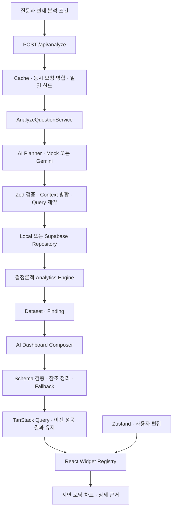

# Prism AI

> Ask your data. Build your dashboard.

자연어로 이커머스 데이터에 질문하고, 계산 근거가 있는 대시보드를 구성하는
Generative Analytics Workspace다. AI는 허용된 분석 계획과 위젯을 선택하고,
매출·비율·증감률·순위는 애플리케이션 코드가 계산한다.

## 현재 구현

Phase 8의 포트폴리오 마무리 단계다. 고정 시드 합성 데이터와 Mock AI가 기본이며,
API Key 없이 로컬 데모를 사용할 수 있다. Gemini와 Supabase는 선택적 서버 어댑터다.

- 729일, 10,935개 일별 합성 Row의 매출·주문·판매 수량·광고 효율·환불 분석
- 질문에서 검증된 Query DSL과 DashboardSpec으로 이어지는 분석 Pipeline
- 후속 질문의 기간·지표·필터 유지, 비교 기준 변경, 차트 선택 상세 분석
- KPI, 추이, 가로 막대, 도넛, 누적 막대, 캘린더 히트맵, 표, 분석 근거
- 위젯 이동·크기 조절·삭제·표시 형식 변경과 Undo/Redo, 브라우저별 편집 저장
- 최근 분석 20개와 세션별 버전 복원, AI 재호출 없는 저장 기록 재열기
- 일부 Query 실패 시 성공 결과 유지, Composer 실패 시 기본 화면 구성
- 결과 Cache, 동시 요청 병합, 일일 데모 한도와 Live AI Kill Switch

기능 구현과 검증 완료는 구분한다. 현재 테스트 실행은 사용자 요청으로 보류 중이며,
이번 변경의 실제 확인 결과와 제한은 [개발 진행 기록](docs/PROGRESS.md)에 남긴다.

## 설계



**AI와 계산의 경계.** 모델이 SQL이나 React 코드를 생성해 실행하는 경로는 없다.
허용된 지표·차원·위젯만 Schema로 받아 처리한다. Gemini가 내놓은 구성은 Zod와
의미 검증을 다시 거치며, 표시용 Business Number가 포함된 모델 문구를 거부한다.

**상태의 소유권.** 분석 응답은 TanStack Query, 편집값은 Zustand가 소유한다.
차트 선택은 일시적 React 상태이고, History는 다시 검증하는 Local Storage 기록이다.
후속 질문이 실패해도 이전 성공 대시보드를 유지한다.

**표현의 경계.** Header, 공통 Card, Widget Registry, 위젯별 Dataset 연결,
실제 Chart, 편집 Grid와 Control을 분리했다. 자동 Layout은 데이터 밀도와
브레이크포인트로 계산하고 사용자가 저장한 Custom Layout은 보존한다.

**성능의 확인 범위.** 편집기는 분석 완료 뒤, 각 Chart는 해당 Widget이 렌더링될 때
별도 Chunk로 로드한다. 이는 편집 버튼을 눌렀을 때만 Editor가 로드된다는 뜻은 아니다.
[성능 기록](docs/PERFORMANCE.md)은 현재 빌드의 초기 자산과 다섯 차트의 정적
전송량을 다루며, 실제 Web Vitals 개선을 주장하지 않는다.

## 기술 구성

Next.js 16.3.3, React 19.2.8, TypeScript strict, Tailwind CSS 4,
TanStack Query, Zustand, Zod, Nivo, react-grid-layout을 사용한다.
검증 도구는 ESLint, TypeScript, Vitest, React Testing Library, Playwright다.
정확한 버전은 `package.json`과 `package-lock.json`을 따른다.

## 로컬 실행

Bootstrap 환경은 Node.js `v26.4.0`, npm `11.17.0`이다. npm만 사용한다.

```bash
npm ci
npm run dev
```

[로컬 화면](http://localhost:3000)에서 시작한다. 환경 변수가 없는 경우 Local Data와
Mock AI가 기본이다. 기존 `.env`가 있다면 선택한 Provider 설정이 적용된다.
Live 설정이 있는 환경에서도 Mock 데모를 강제하려면:

```bash
AI_PROVIDER=mock AI_LIVE_ENABLED=false DATA_SOURCE=local PERSIST_ANALYSIS_HISTORY=false npm run dev
```

선택적 연동 설정은 `.env.example`에 있다. Gemini Key와 서버 Secret은 서버에만 둔다.
대표 시연 순서와 확인할 결과는 [데모 가이드](docs/DEMO.md)를 따른다.

## 검증

현재 세션에서는 테스트와 react-doctor를 실행하지 않는다. 테스트를 포함하지 않는
확인 명령은 다음과 같다.

```bash
npm run lint
npm run typecheck
npm run build
npm run analyze:bundle
```

테스트 실행을 허용한 뒤에는 다음 순서를 사용한다.

```bash
npm run check
npm run test:e2e
```

`check`는 lint, typecheck, Unit Test, build를 포함한다. E2E는 **빌드가 필요**하며
127.0.0.1:3100의 별도 Production Server를 사용한다. 기존 개발 서버를 재사용하지
않고 Mock AI·Local Data·Live 비활성화를 강제한다. 브라우저가 없으면 먼저
`npm exec -- playwright install chromium`을 실행한다.

## 제한과 남은 작업

- 합성 이커머스 Domain과 등록된 질문·지표 범위를 지원한다. Mock은 규칙 기반이다.
- 일별 집계 고객 수의 합은 기간 전체의 고유 고객 수가 아니다.
- Cache·Rate Limit·동시 요청 병합은 단일 Server Instance 범위다.
- History와 편집 저장은 브라우저별이며 공유 링크·계정 동기화는 제공하지 않는다.
- 진행 단계는 안내 UI이며 서버 진행 이벤트를 실시간 Stream하지 않는다.
- Gemini 호출 Timeout은 있지만 Browser부터 Provider까지 사용자 취소를 전파하는
  기능은 아직 없다.
- 실제 DB 연동 검증, 배포 환경 Web Vitals, 스크린샷과 데모 영상은 별도 확인이 필요하다.

## 문서

- [제품 범위와 사용자 흐름](docs/PROJECT_SPEC.md)
- [모듈 경계와 API·상태 소유권](docs/ARCHITECTURE.md)
- [지표·Query DSL·AI Schema](docs/ANALYTICS_AI_SPEC.md)
- [단계별 구현 계획](docs/IMPLEMENTATION_PLAN.md)
- [품질과 보안 기준](docs/QUALITY_GUIDE.md)
- [실제 진행 및 검증 기록](docs/PROGRESS.md)
- [성능 측정](docs/PERFORMANCE.md)
- [대표 데모 시나리오](docs/DEMO.md)
